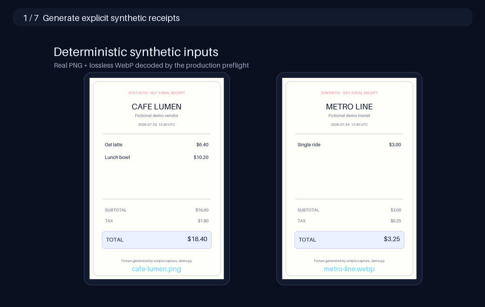
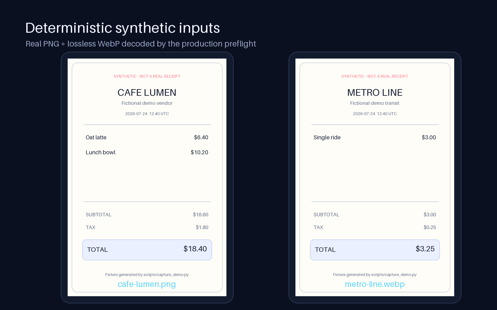
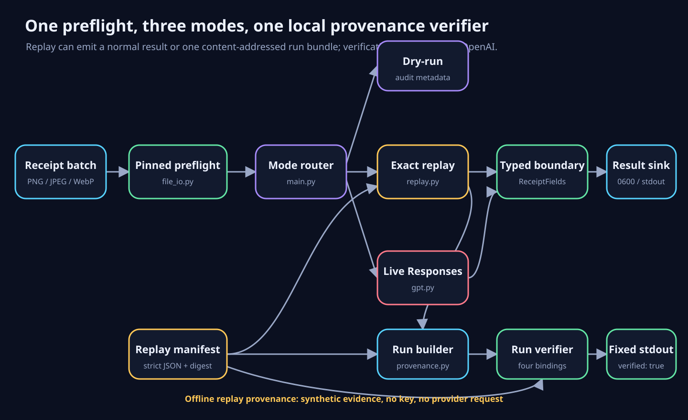
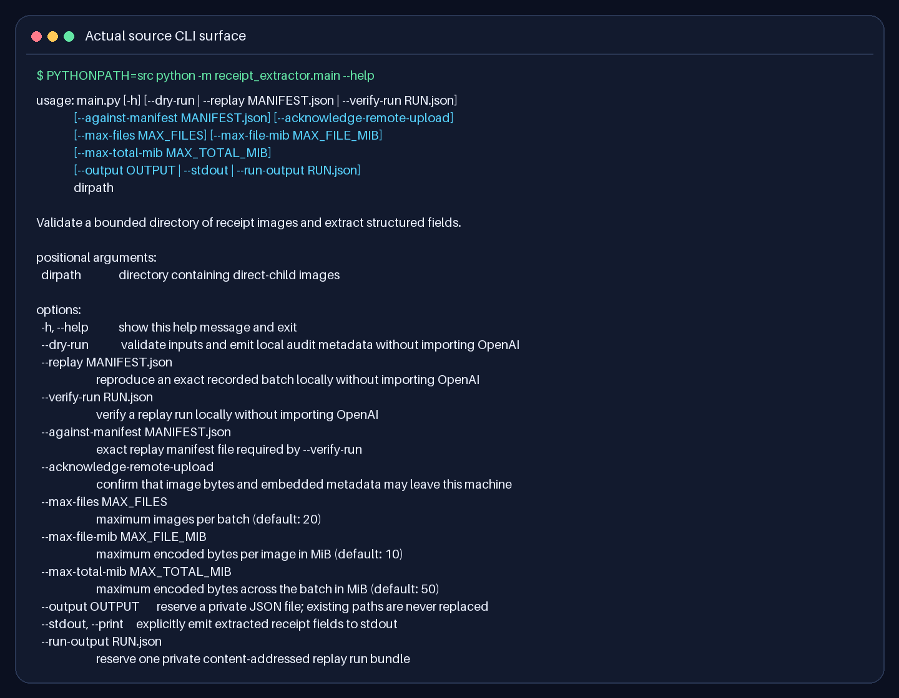
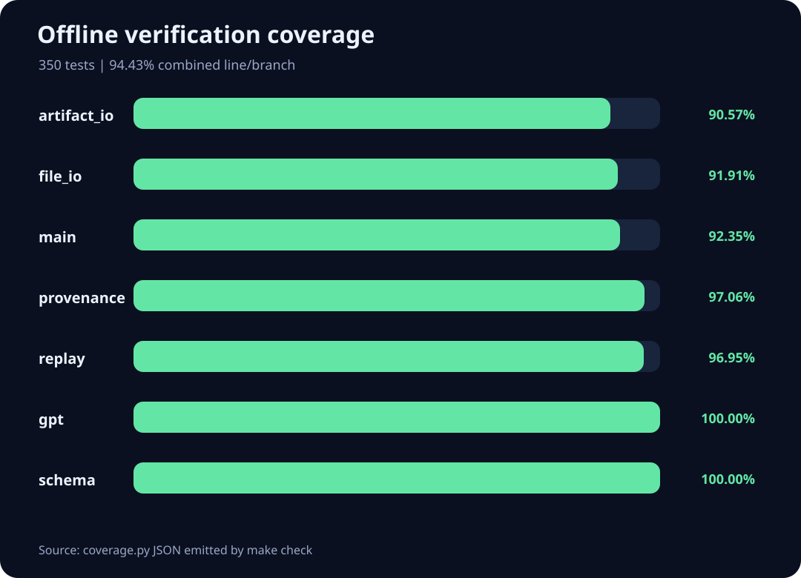
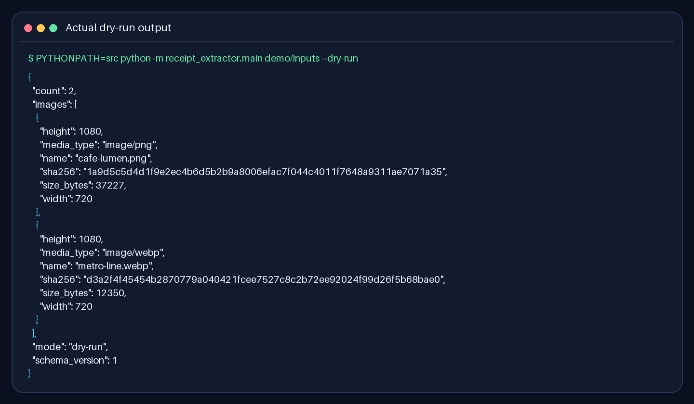
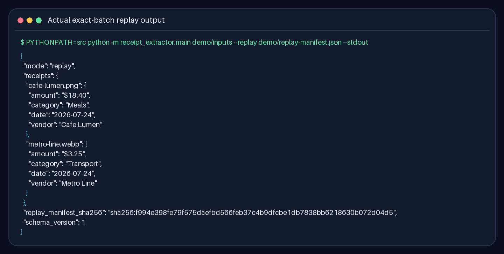
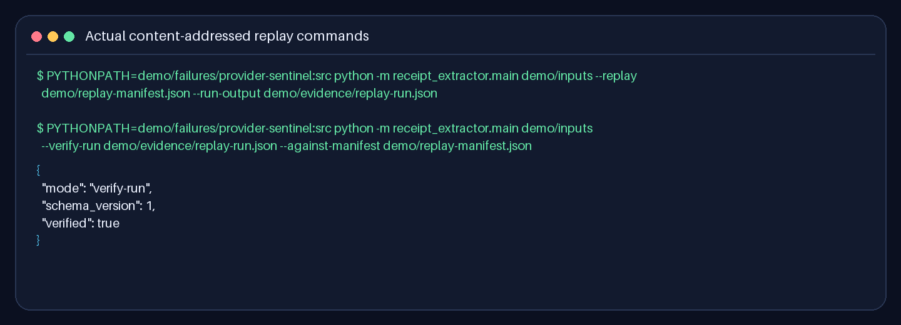
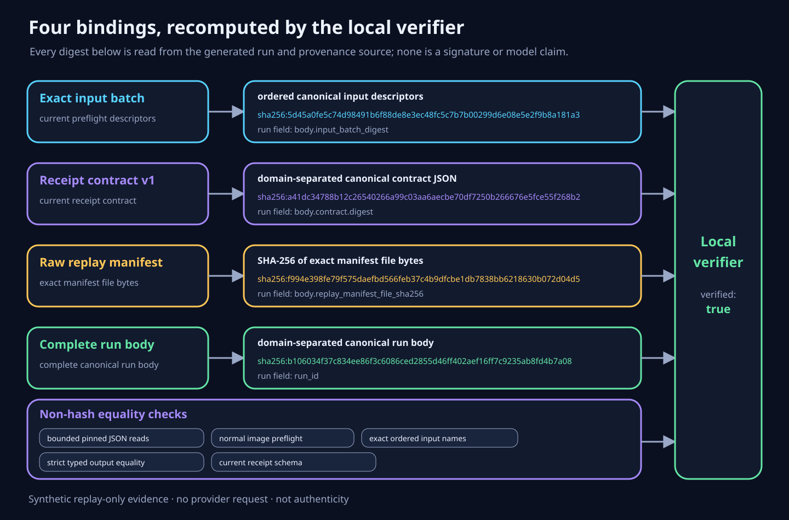
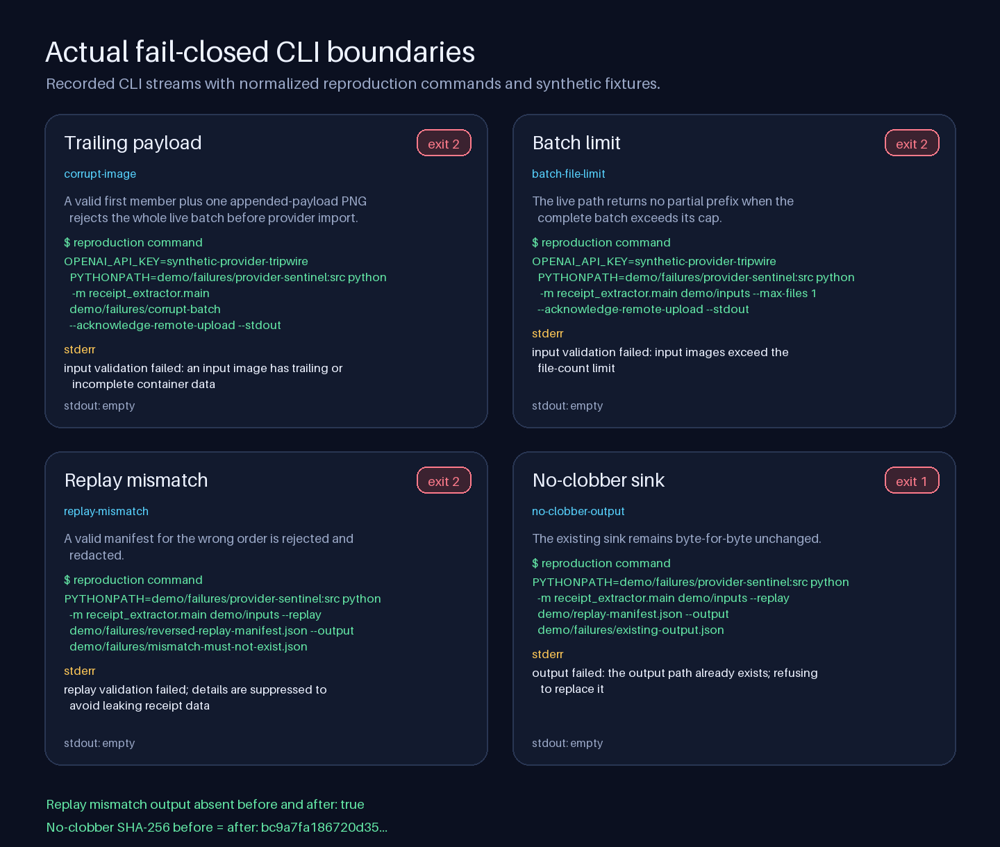

# Auditable Receipt Extractor

A privacy-explicit multimodal pipeline that validates an entire receipt-image
batch before sending the first byte, parses model output into a strict schema,
can reproduce an exact recorded batch without OpenAI, and can create and verify
a content-addressed local replay receipt.

This repository began as a small A1220 lab. Its original history remains
visible; later reviewable commits turn it into a document-intelligence project
with bounded inputs, typed outputs, deterministic replay, and evidence that
does not rely on private receipts.



The animation above is rebuilt from the current source, generated fixtures,
captured CLI streams, and coverage.py data. It is not a recording of a model
call, and the failure frame contains only deliberately synthetic cases.

## What works today

- PNG, JPEG, and WebP are checked by extension, signature, decoded format, and
  exact container boundary.
- Every accepted image is fully decoded under a 25-megapixel ceiling.
- Directory and file descriptors are pinned while identities are checked
  before and after bounded reads.
- The complete batch is preflighted before the first provider request.
- OpenAI Responses parsing targets a strict four-field Pydantic contract.
- Offline replay binds a versioned manifest to the exact ordered image batch.
- Replay can emit one content-addressed run bundle that binds the batch,
  contract, exact manifest bytes, ordered names, and typed outputs.
- A separate offline mode verifies that bundle against current inputs and the
  exact replay manifest without importing OpenAI.
- Result files are private, exclusive, no-clobber reservations; stdout is
  opt-in.
- Provider failures are redacted at the CLI boundary.

The project does **not** claim live-model accuracy, authenticity, authorship, or
proof that a model ran. Public tests and examples use synthetic images, and no
live API call is needed to verify the engineering claims.

## Verified synthetic demo

The repository ships one real PNG and one lossless WebP fixture. Both are
generated deterministically, visibly marked synthetic, decoded by the
production preflight, and bound to the checked-in replay manifest by name,
MIME type, byte size, SHA-256, width, and height.



Their outputs are authored fixture truth for exercising the pipeline—not
evidence that a model read the images. The exact source artifacts are
[the generated inputs](demo/inputs),
[the strict manifest](demo/replay-manifest.json), and
[the captured replay result](demo/evidence/replay-result.json).

### Architecture



Replay and live extraction deliberately converge on the same `ReceiptFields`
validation boundary. Dry-run stops after preflight and emits only audit
metadata. Replay substitutes a strictly bound local provider and can either
emit the existing result shape or build a single provenance bundle. Run
verification recomputes four digest bindings plus ordered-name, typed-output,
bounded-read, preflight, and schema checks.

## Setup

The supported runtime is Python 3.12 on Linux.

```bash
python3 -m venv .venv
source .venv/bin/activate
python -m pip install -r requirements.txt
python -m pip install --no-deps -e .
```



Install the separately pinned development tools and run the complete offline
gate:

```bash
python -m pip install -r requirements-dev.txt
make check
```

`make audit` is intentionally separate because dependency-advisory lookup is a
networked operation. The regular gate uses generated images and fake providers;
it makes no model request. The current gate is 221 tests with 93.26% combined
statement and branch coverage.



The bounded source data is checked in as
[`demo/evidence/coverage-summary.json`](demo/evidence/coverage-summary.json).

## Inspect a batch locally

Dry-run validates every direct-child image and prints only audit metadata:

```bash
PYTHONPATH=src python -m receipt_extractor.main demo/inputs --dry-run
```

Names and digests are still sensitive metadata: filenames may contain personal
information, and hashes can be correlatable. Dry-run output is inspection data,
not automatically safe publication evidence.

The complete actual two-image output—not a shortened illustrative object—is
stored in
[`demo/evidence/dry-run.json`](demo/evidence/dry-run.json):



## Reproduce a recorded batch offline

A replay manifest contains an ordered input descriptor and one typed output for
every receipt. Its batch digest is a domain-separated SHA-256 over the canonical
ordered descriptors.

```bash
PYTHONPATH=src python -m receipt_extractor.main demo/inputs \
  --replay demo/replay-manifest.json \
  --stdout
```

Replay performs these steps before reserving the result:

1. preflight every image through the normal image boundary;
2. read the manifest through pinned descriptors without following symlinks;
3. reject hard links, oversized files, duplicate JSON keys, non-finite values,
   invalid UTF-8, unknown fields, and scalar coercion;
4. verify the manifest's internal digest;
5. compare every ordered name, MIME type, byte size, SHA-256, width, and height
   against the actual validated batch.

Only then are recorded outputs consumed exactly once. `--replay` is mutually
exclusive with dry-run and rejects the remote-upload acknowledgement. It does
not require `OPENAI_API_KEY` and does not import the OpenAI package.

The digest is a **dataset mismatch guard**, not a signature, timestamp, or
proof of model provenance. Anyone able to edit a manifest can recompute it.
Replay manifests also contain extracted receipt fields and must be protected
like the original results.

The checked-in manifest produces this exact current output without a key or
OpenAI import:



## Create and verify a content-addressed replay run

Use a fresh private path under the local virtual environment to materialize the
same synthetic replay as one content-addressed bundle:

```bash
PYTHONPATH=src python -m receipt_extractor.main demo/inputs \
  --replay demo/replay-manifest.json \
  --run-output .venv/replay-run.json
PYTHONPATH=src python -m receipt_extractor.main demo/inputs \
  --verify-run .venv/replay-run.json \
  --against-manifest demo/replay-manifest.json
```

The first command intentionally prints nothing and creates one exclusive
mode-`0600` file. The second accepts no output sink and prints only the fixed
aggregate document:

```json
{
  "mode": "verify-run",
  "schema_version": 1,
  "verified": true
}
```

These are the two real production CLI commands captured here; the empty first
stdout has not been replaced with an invented success message:



The synthetic run binds four independently recomputed digest identities:

1. the exact ordered preflighted input descriptors;
2. the explicit versioned `ReceiptFields` contract;
3. the raw bytes of the exact replay manifest file;
4. the complete canonical run body, including ordered names and typed outputs.



Verification also enforces bounded descriptor-pinned reads, normal image
preflight, exact ordered names, strict typed-output equality with the manifest,
and the current schema identity. The checked-in evidence is the actual
[`replay-run.json`](demo/evidence/replay-run.json), fixed
[`run-verification.json`](demo/evidence/run-verification.json), and generated
[`provenance-source.json`](demo/evidence/provenance-source.json). That source
file records normalized repository-relative argv, exit and stream hashes, all
other generated artifact hashes, and hashes of the source and tests used to
rebuild the evidence. The complete identity specification is
[`docs/run-provenance.md`](docs/run-provenance.md).

This is a replay-only local consistency receipt. It is not a signature,
authenticity or authorship proof, trusted timestamp, model-execution proof, or
accuracy result. A run bundle includes filenames and extracted receipt fields
and can expose correlatable digests; protect a real bundle like the original
receipts and replay manifest. The tracked bundle is safe to publish only
because every input and output is deliberately synthetic.

## Run live extraction

Set the key only in the process environment. Never place it in a repository
file or pass its value as a Make argument.

```bash
export OPENAI_API_KEY=your_key_here
PYTHONPATH=src python -m receipt_extractor.main receipts \
  --acknowledge-remote-upload \
  --output result.json
```

Live mode requires all three deliberate choices:

- `OPENAI_API_KEY` is present;
- `--acknowledge-remote-upload` confirms that original image bytes and embedded
  metadata may leave the machine;
- either `--output` or `--stdout` selects where sensitive results go.

The adapter uses `gpt-4.1-mini`, image detail `high`, and typed
`client.responses.parse(...)` output. The provider-facing contract requires all
four fields while allowing an unknown field value to be `null`:

```json
{
  "date": "2026-07-24",
  "amount": "$12.50",
  "vendor": "Synthetic Market",
  "category": "Other"
}
```

`amount` remains text so currency marks and printed formatting are not silently
lost. Category is closed to Meals, Transport, Lodging, Office Supplies,
Entertainment, or Other. Extra keys, missing keys, numeric coercion, unknown
categories, and hidden control characters fail the boundary.

OpenAI documents image input for the
[Responses API](https://developers.openai.com/api/docs/guides/images-vision)
and typed
[Structured Outputs](https://developers.openai.com/api/docs/guides/structured-outputs).
The request sets `store=False`; this should not be interpreted as a universal
zero-retention guarantee. Review the current provider terms and your
organization's data controls before processing real receipts.

## Output safety

`--output` and `--run-output` reserve a brand-new `0600` `.json` file with
`O_EXCL` before live extraction or replay materialization. Existing regular
files, links, FIFOs, and receipt inputs are never replaced. The parent must be
owned by the current user, not group- or world-writable, and not a symlink.

Handled failures remove an uncommitted reservation when its identity can still
be proven. If cleanup or directory durability cannot be confirmed, the CLI
warns and asks the operator to inspect the destination. A host crash can also
leave an empty or partial private file. Processes under the same OS account
remain inside this local trust boundary.

`--stdout` is explicit because vendor names and amounts can otherwise enter
shell history, CI logs, or terminal capture:

```bash
PYTHONPATH=src python -m receipt_extractor.main receipts \
  --acknowledge-remote-upload \
  --stdout
```

## Observed failure boundaries

The demo generator executes four expected failures through the production CLI,
requires exact exit codes and streams, and renders the results without
inventing terminal output:



- **Trailing payload:** a valid generated PNG with appended bytes is rejected
  after full image decoding because its container boundary is no longer exact.
- **Batch limit:** two valid inputs with `--max-files 1` produce no partial
  result.
- **Replay mismatch:** an internally valid manifest for the reversed input
  order is rejected while a new result path remains absent before and after.
- **No clobber:** replay cannot replace a pre-existing JSON sentinel; its
  SHA-256 is identical before and after the command.

The first two cases enter live mode with a visibly synthetic environment
sentinel and put a poison `openai.py` first on `PYTHONPATH`. Reaching provider
import before complete preflight would therefore fail with the wrong stream and
invalidate generation. No provider request is made.

The exact ledger is
[`demo/evidence/failure-paths.json`](demo/evidence/failure-paths.json), and all
inputs are under [`demo/failures/`](demo/failures). The annotations in the PNG
state the checked invariant. Exit code, stdout, and stderr come from the
recorded subprocess; each normalized reproduction command is derived from the
same logical arguments and environment flags without exposing the generator's
temporary absolute paths or interpreter location. Generation executes against
private scratch copies under `.venv`, so a future no-clobber regression cannot
damage the tracked sentinel while it is being detected.

## Bounded threat model

| Boundary | Enforced | Not claimed |
| --- | --- | --- |
| Image discovery | direct children, entry/file/batch limits, deterministic order | hostile kernel or compromised same-user process |
| Image parsing | exact PNG/JPEG/WebP bounds, full decode, frame and pixel limits | malware scanning or metadata removal |
| Provider | explicit upload acknowledgement, bounded retries/timeout, typed response | model accuracy or zero retention |
| Replay | exact ordered batch, strict manifest, pinned reads | signature, authenticity, or independent attestation |
| Run provenance | four digest bindings, ordered names/outputs, current schema, exact manifest bytes | authorship, timestamp, model execution, or tamper-proof history |
| Output | private no-clobber file, held descriptor, cleanup checks | atomic recovery from power or host failure |

Caught provider exception text is not printed. This narrow guarantee does not
cover SDK or HTTP debug logging, so leave such logging disabled for sensitive
data.

## Rebuild every visual

Visual evidence is generated by
[`scripts/capture_demo.py`](scripts/capture_demo.py), not edited by hand. The
exact help transcript is also available as
[`demo/evidence/help.txt`](demo/evidence/help.txt). The generator:

1. creates both visibly synthetic receipts;
2. loads them through `file_io.load_images`;
3. builds the canonical exact-batch manifest;
4. executes the real help, dry-run, and replay commands with no API key;
5. creates and verifies the replay-run bundle in a private scratch directory
   with the poison provider first on `PYTHONPATH`;
6. publishes the synthetic bundle only after successful local verification;
7. executes four expected failures, including live preflight guarded by a
   poison provider import;
8. records exact streams, normalized repository-relative argv, output absence,
   and no-clobber hashes;
9. reads coverage.py JSON from the full test run;
10. renders real terminal captures, diagrams, chart, failure gallery, and the
    seven-frame GIF;
11. records SHA-256 and byte size for every other generated artifact and
    relevant source, then rejects any path outside the exact 27-file allowlist.

Regenerate the tracked artifacts:

```bash
make demo
```

This command bootstraps from the non-evidence tests, rebuilds the generated
tree, then runs the complete suite, regenerates from that full-suite coverage,
and runs the complete suite again. The bootstrap rendering is transient; only
the full-suite result remains in the tracked tree.

Prove they are current without touching the tracked copies:

```bash
make demo-check
```

`demo-check` rebuilds everything under `.venv/demo-check` and recursively
compares the result byte-for-byte with `demo/` and `docs/assets/`. If a code,
fixture, command, manifest, test-count, coverage, or rendering change affects
the evidence, the check fails until the visual refresh is intentional.

## Project layout

```text
src/receipt_extractor/
  artifact_io.py   # shared bounded, descriptor-pinned strict JSON reads
  file_io.py       # pinned-FD discovery, bounded reads, decode, and data URLs
  gpt.py           # typed OpenAI Responses adapter
  main.py          # CLI, provider boundary, result validation, private output
  provenance.py    # contract identity, replay-run builder, local verifier
  replay.py        # exact-batch manifest loader and offline provider
  schema.py        # strict receipt and category contracts
scripts/
  capture_demo.py  # fixtures, real CLI captures, diagrams, chart, and GIF
demo/
  inputs/          # visibly synthetic PNG and lossless WebP receipts
  failures/        # corrupt batch, reversed manifest, provider tripwire, sink
  evidence/        # exact streams, run bundle, source hashes, and coverage
  replay-manifest.json
docs/assets/       # generated README visuals; checked by make demo-check
tests/
  test_artifact_io.py      # strict JSON, links, bounds, and replacement attacks
  test_file_io.py          # real formats, limits, links, and TOCTOU regressions
  test_cli.py              # privacy modes, replay integration, output failures
  test_cli_provenance.py   # creation/verification integration and no-clobber
  test_demo_evidence.py    # re-execution, hashes, allowlist, GIF/SVG integrity
  test_gpt.py              # fake typed Responses calls; never a live request
  test_provenance.py       # golden vectors and binding mutation matrix
  test_replay.py           # manifest grammar, path attacks, exact-batch binding
  test_schema.py           # strict field and category adversarial cases
```

## License and provenance

MIT License. See [LICENSE](LICENSE). The original lab history remains visible;
the production-hardening and evidence work is added as later commits rather
than presented as part of the initial submission.
